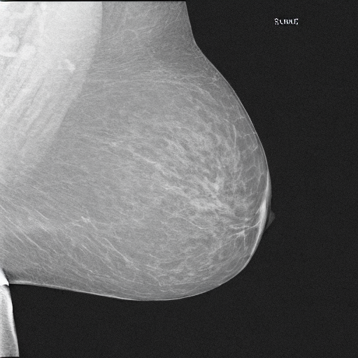
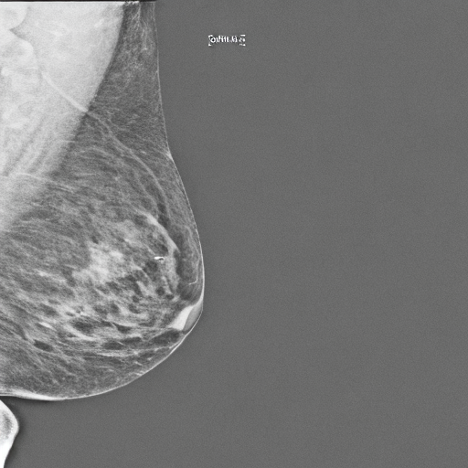
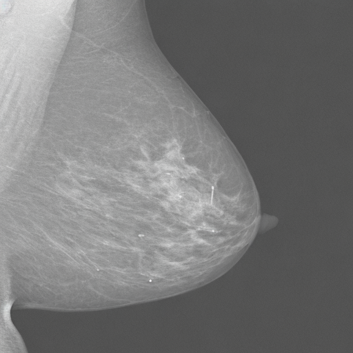
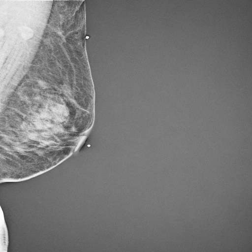

# MammoDiffusion Studio

Interfaccia Gradio locale, ispirata al layout essenziale di Fooocus, per
generare mammografie MLO con due generatori MammoDiffusion selezionabili dalla
GUI.

L'app legge la selezione corrente da `configs/selected_generators.json` e usa:

- G02, Stable Diffusion 2.1 fine-tuned: `checkpoint-3000`;
- G07, LDM from scratch con SD-VAE: `ldm_unet_best_eval.keras`, selezionato
  dallo sweep allo `step_130000`;
- i prompt positivo e negativo definiti per il fine-tuning SD2.1;
- per G02, `100` inference step e guidance scale `7.5` come valori
  predefiniti;
- per G07, `100` sample step e guidance scale `1.5` come valori
  predefiniti.

Le immagini vengono generate sequenzialmente per contenere l'uso della VRAM e
salvate in `assets/mammodiffusion_gradio/outputs/`. Questa cartella è separata
da `data/synthetic/02_sd21_filtered_100steps`, quindi usare la demo non modifica il dataset
ufficiale né i risultati finali.

Ogni richiesta di generazione viene eseguita in un subprocess dedicato. Quando
il subprocess termina, la VRAM usata dal modello selezionato viene rilasciata
dal sistema, permettendo di passare da G02 a G07, e viceversa, senza
riavviare Gradio. I log tecnici del worker vengono salvati in `worker.log`
dentro la cartella output della singola generazione.

## Prerequisiti

I pesi non vengono pubblicati su GitHub. Prima dell'avvio devono essere
presenti localmente:

- `notebooks/pretrained_model/stable-diffusion-2-1-base`;
- `experiments/diffusers/02_sd21_filtered_100steps/model/checkpoint-3000/unet`;
- `experiments/diffusers/07_ldm_sdvae_extra1361/checkpoints_ldm/ldm_unet_best_eval.keras`;
- `experiments/diffusers/07_ldm_sdvae_extra1361/checkpoints_ldm/ldm_step130000.keras`;
- `experiments/diffusers/07_ldm_sdvae_extra1361/latents/latent_stats.npz`;
- `results/diffusers/07_ldm_sdvae_extra1361/metrics/best_checkpoint.json`.

## Avvio

Dalla root del progetto, usando un ambiente con PyTorch/Diffusers e
TensorFlow/Keras:

```bash
python -m pip install -r assets/mammodiffusion_gradio/requirements.txt
python assets/mammodiffusion_gradio/app.py --open-browser
```

L'interfaccia sarà disponibile su <http://127.0.0.1:7860>.

Per renderla raggiungibile nella rete locale:

```bash
python assets/mammodiffusion_gradio/app.py --host 0.0.0.0
```

L'opzione `--share` crea invece un link Gradio pubblico temporaneo. Non usarla
con dati sensibili.

## Controlli

- **Modello** seleziona il best checkpoint di G02 oppure quello di G07.
- **Etichetta** seleziona il prompt standard positivo o negativo.
- **Numero di immagini** genera da 1 a 12 immagini.
- **Seed iniziale** vale `-1` per un seed casuale; impostando un intero, la
  generazione è riproducibile.
- Le impostazioni avanzate consentono di modificare step e guidance scale
  senza cambiare i valori predefiniti usati nell'esperimento.

La demo è destinata esclusivamente a ricerca e presentazione, non all'uso
clinico.

## Esempi

Alcuni output storici riproducibili generati dalla demo con etichetta positiva,
pesi G02 `checkpoint-3000` e seed consecutivi a partire da `42` sono disponibili
nella cartella [`examples/`](examples/). Possono provenire dalla precedente
ablation a 50 step e non rappresentano il nuovo default canonico a 100 step.

| Seed 42 | Seed 43 |
|---|---|
|  |  |

| Seed 44 | Seed 45 |
|---|---|
|  |  |
